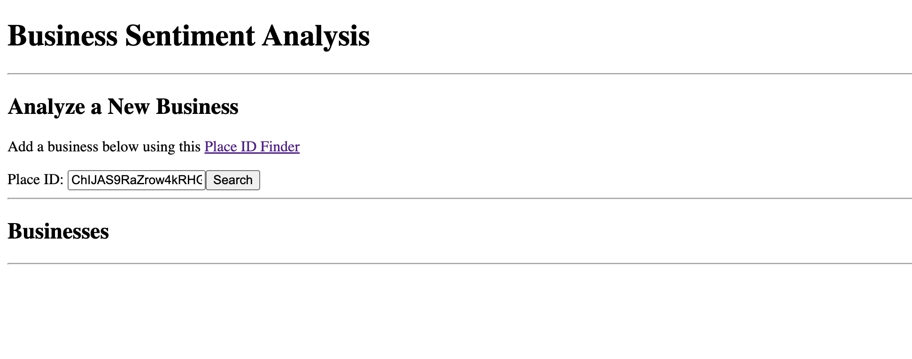
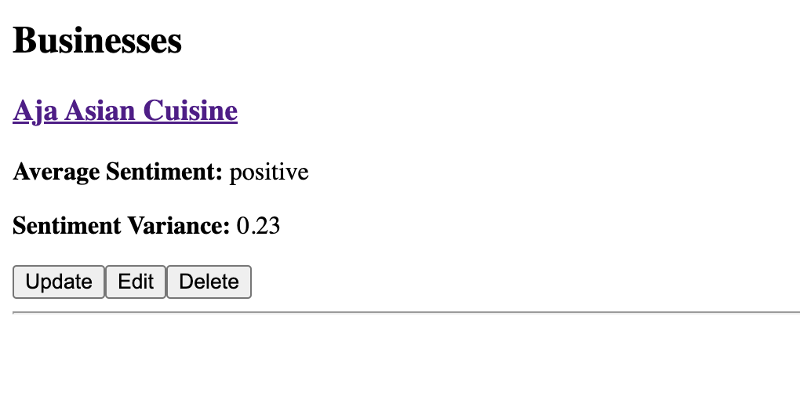
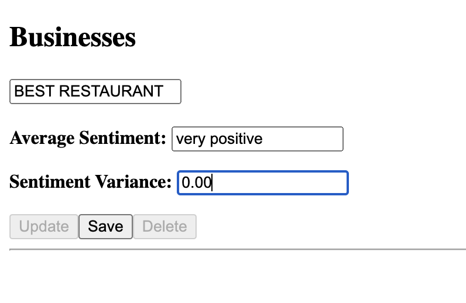

# Business Sentiment Analysis

#### **A RESTful API for performing sentiment analysis on recent business reviews, with a companion React app**

## Motivation

The ratings and reviews for businesses online are often outdated and, as a result, inaccurate.

The Business Sentiment Analysis RESTful API performs sentiment analysis on the most recent reviews of any business supported by the [Google Places API](https://developers.google.com/maps/documentation/places/web-service/overview), providing users with up-to-date and accurate information about the business.

#### **The API and app are not publicly deployed because the Google Places API is not free. However, you are more than welcome to deploy the API locally or publicly for your own use. :)**

## API Local Setup

To configure this API on your local machine, fork this repository and enter your Google Places API key in the `business-sentiment-analysis/src/main/java/com/tim_liang/business_sentiment_analysis/PlacesAPIHandler.java` file:

```
private static final String API_KEY = "API_KEY";
```

Then `cd` into the `business-sentiment-analysis` folder (this is where the API backend code is) using your terminal and run (make sure you have Java 17+):

```
./mvnw clean package
java -jar target/business-sentiment-analysis-0.0.1-SNAPSHOT.jar
```

Now, the RESTful resource for business sentiment analysis is deployed at `http://localhost:8080/business/`.

## App Usage

You can consume the deployed API in anyway you like (curl, your own app, etc.). This short guide will detail how to consume the API using the provided companion app.

In this forked repository, `cd` into the `app` folder (this is where the app is housed) using your terminal and run (make sure you have node and npm):

```
npm run dev
```

Now, the app should be deployed, with its url provided in the terminal output.

### Example

The API supports CRUD operations. This example will go through each operation.

**CREATING:** Enter the place ID of the desired business and click "Search".



---

**READING:** After loading, the new entry should be posted to the database and loaded on the app.



---

**UPDATING:** Click the "Update" under the entry. The most recent reviews will be fetched and the sentiment and variance will be recalculated.

Alternatively, you could manually update the sentiment using the "Edit" button. Then click "Save" to post the modified data to the database.



---

**DELETING:** Click the "Delete" button and the entry will be deleted from the database.

## Support

Encounter an issue?

If you find a bug or have a feature request, please file an issue or email me at timliang4@gmail.com. Or, if you'd like to contribute, feel free to submit a pull request.
